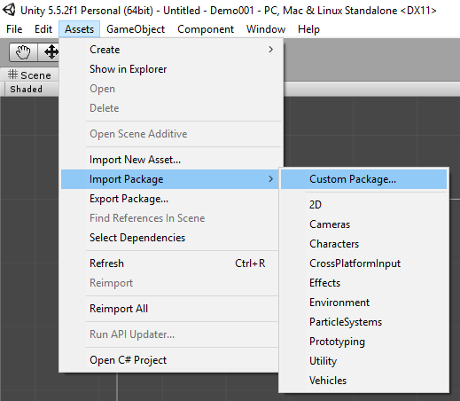
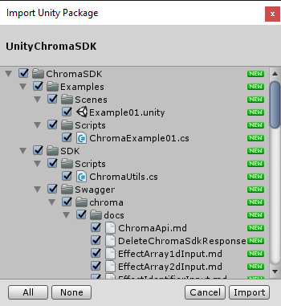
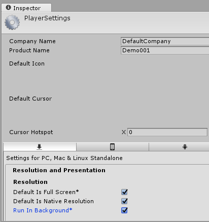
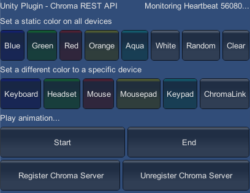
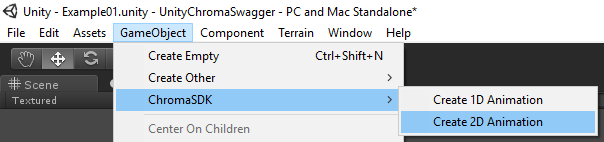
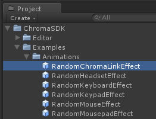
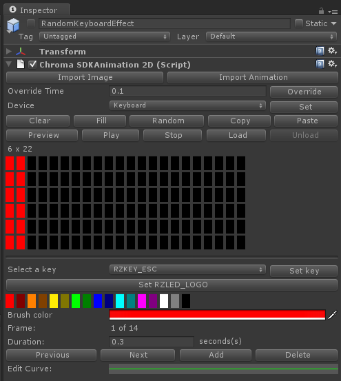
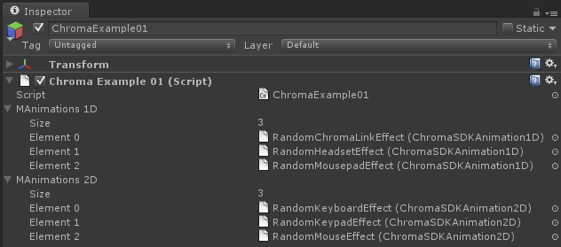
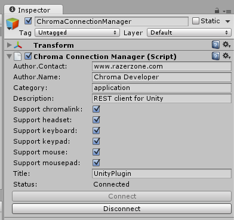

# UnityChromaSDK - the Unity C# library for the Chroma Rest API

# Deprecated

* Note: Visit the [Chroma Animation Guide](https://chroma.razer.com/ChromaGuide/) to find the latest supported plugin for Chroma RGB.

* Note: This version of the Unity plugin is deprecated.

* Note: Go to [Unity_SampleApp](https://github.com/razerofficial/Unity_SampleApp) for the latest Unity plugin.

---

**Table of Contents**

* [Related](#related)
* [Frameworks supported](#frameworks-supported)
* [Dependencies](#dependencies)
* [Packaging](#packaging)
* [Getting Started](#getting-started)
* [Assets](#assets)
* [Plugins](#plugins)
* [Documentation for API Endpoints](#documentation-for-api-endpoints)
* [Examples](#examples)
* [Chroma Initialization](#chroma-initialization)
* [Chroma Heartbeat](#chroma-heartbeat)
* [Destroy the Chroma Session](#destroy-the-chroma-session)
* [PUT vs POST](#put-vs-post)
* [PUT Effect](#put-effect)
* [Remove Effect](#remove-effect)
* [PUT CHROMA_NONE Effect](#put-chroma_none-effect)
* [POST CHROMA NONE Effect](#post-chroma_none-effect)
* [Colors](#colors)
* [PUT CHROMA_STATIC Effect](#put-chroma_static-effect)
* [POST CHROMA_STATIC Effect](#post-chroma_static-effect)
* [PUT CHROMA_CUSTOM Effect](#put-chroma_custom-effect)
* [POST CHROMA_CUSTOM Effect](#post-chroma_custom-effect)
* [EffectType](#effecttype)
* [PUT EffectType](#put-effecttype)
* [POST EffectType](#post-effecttype)

<a name="related"></a>
## Related

- [CChromaEditor](https://github.com/RazerOfficial/CChromaEditor) - C++ Native MFC Library for playing and editing Chroma animations

- [GameMakerChromaExtension](https://github.com/RazerOfficial/GameMakerChromaExtension) - GameMaker Extension to control lighting for Razer Chroma

- [HTML5ChromaSDK](https://github.com/RazerOfficial/HTML5ChromaSDK) - JS Library for playing Chroma animations

- [UE4ChromaSDK](https://github.com/RazerOfficial/UE4ChromaSDK) - Unreal Engine 4 (UE4) Blueprint library to control lighting for Razer Chroma

- [UnityNativeChromaSDK](https://github.com/RazerOfficial/UnityNativeChromaSDK) - Unity native library for the ChromaSDK

- [UnityChromaSDK](https://github.com/RazerOfficial/UnityChromaSDK) - Unity C# library for the Chroma Rest API

<a name="frameworks-supported"></a>
## Frameworks supported
- Unity 3.5.7 or later
- Windows Editor / Standalone

<a name="dependencies"></a>
## Dependencies
- [RestSharp](https://www.nuget.org/packages/RestSharp) - 105.1.0 or later
- [Json.NET](https://www.nuget.org/packages/Newtonsoft.Json/) - 7.0.0 or later

<a name="packaging"></a>
## Packaging

Import [UnityChromaSDK.unitypackage](https://github.com/razerofficial/UnityChromaSDK/releases/tag/UnityChromaSDK) into your project.

<a name="getting-started"></a>
## Getting Started

1 Install [Unity3d](https://unity3d.com/)

2 Open Unity and start with an existing project or open a new project


3 Download the [UnityChromaSDK.unitypackage](https://github.com/razerofficial/UnityChromaSDK/releases/tag/UnityChromaSDK) file

4 Import the `UnityChromaSDK.unitypackage` using the `Assets->Import Package->Custom Package...` and select the downloaded file



5 Select all the files and click the `Import` button



6 Open the example scene [Assets/ChromaSDK/Examples/Scenes/Example01.unity](Assets/ChromaSDK/Examples/Scenes/Example01.unity)

7 Be sure to select `Run in background` in the player settings, so that `Chroma` still works when Unity doesn't have focus



8 Hit play


9 Customize the example script [Assets/ChromaSDK/Examples/Scripts/ChromaExample01.cs](Assets/ChromaSDK/Examples/Scripts/ChromaExample01.cs)



<a name="assets"></a>
## Assets

Use the `GameObject->ChromaSDK` menu to create `1D` and `2D` animations.



Once created, the gameobjects can be renamed and dragged to the `Object Hierarchy` to turn into prefab assets.



`1D` assets have a custom inspector that can be used to view, edit, and paint animation frames.
 

 
`2D` assets also have a custom inspector with the ability to paint specific keys (keyboard) and leds (mouse).
 


The custom inspectors set the device type and allow the color animation frames to be edited.
`1D` animations support `ChromaLink`, `Headset`, and `Mousepad` devices.
`2D` animations support `Keyboard`, `Keypad`, and `Mouse` devices.
The `device preview` shows a grid and clicking the elements will set the color from the color swatches.
The `Curve` adjusts the timings for each animation frame.

In the `Example01` scene, the `1D` and `2D` prefab assets are referenced.
The [ChromaExample01.cs](Assets/ChromaSDK/Examples/Scripts/ChromaExample01.cs) script uses public `ChromaSDKAnimation1D[]` and `ChromaSDKAnimation2D[]` arrays as meta references to the prefabs. 
In order for the animations to play in `play-mode`, the prefabs need to be instantiated.
This allows the monobehaviour update event to fire. 



Animation assets rely on the `ChromaConnectionManager` to maintain the REST client connection.
If the REST server connection is lost, the `ChromaConnectionManager` should reconnect.
The `ChromaConnectionManager` also has a custom inspector where the `Chroma` details can be specified.



<a name="plugins"></a>
## Plugins

The following plugins should be included in the game build to allow the REST client to function.

`Assets/Plugins/Newtonsoft.Json.dll` - JSON encoding/decoding library for Unity 3.X/4.X/5.X

`Assets/Plugins/RestSharp.dll` - REST client library for Unity 3.X/4.X/5.X

The following plugins are editor only plugins and should be stripped from the final game build.

`Assets/Plugins/UnityImageNativePlugin3.dll` - Windows native library handles BMP/GIF/JPG/PNG image imports for Unity 3.X

`Assets/Plugins/x64/UnityImageNativePlugin.dll` - (64-bit) Windows native library handles BMP/GIF/JPG/PNG image imports for Unity 4.X/5.X

`Assets/Plugins/x86/UnityImageNativePlugin.dll` - (32-bit) Windows native library handles BMP/GIF/JPG/PNG image imports for Unity 4.X/5.X

<a name="documentation-for-api-endpoints"></a>
## Documentation for API Endpoints

* The [RazerApi](Assets/ChromaSDK/SDK/Swagger/razer/README.md) endpoint creates the Chroma session.
* The [ChromaApi](Assets/ChromaSDK/SDK/Swagger/chroma/README.md) endpoint controls Chroma lighting.

<a name="examples"></a>
## Examples

Add the `Chroma` namespace.

```charp
// Access to Chroma data structures
using ChromaSDK.ChromaPackage.Model;

// Access to the Chroma API
using ChromaSDK.Api;

// Access to the Session data structures
using RazerSDK.ChromaPackage.Model;

// Access to the Session API
using RazerSDK.Api;
```

Calls to the `Chroma` API should be done in a separate thread to avoid blocking the main thread and to avoid reducing the rendering frame rate.

```charp
ChromaUtils.RunOnThread(() =>
{
    // Make calls to the Chroma API in a separate thread to avoid blocking the main thread
    Initialize();
});
```

### `Chroma` Initialization

Create an instance of the `RazerAPI` which will be used to create the `Chroma` session.
 
```csharp
 // use the Razer API to get the session
_mApiRazerInstance = new RazerApi();
```

Populate the input to initialize the `Chroma` session.

```csharp
var input = new ChromaSdkInput();
input.Title = "UnityPlugin";
input.Description = "This is a REST interface Unity client";
input.Author = new ChromaSdkInputAuthor();
input.Author.Name = "Chroma Developer";
input.Author.Contact = "www.razerzone.com";
input.DeviceSupported = new List<string>
{
    "keyboard",
    "mouse",
    "headset",
    "mousepad",
    "keypad",
    "chromalink",
};
input.Category = "application";
```

`PostChromaSdk` creates a `Chroma` session which is used to control the `Chroma` lighting.

```csharp
// create the Chroma session, the result contains the session and base uri for the Chroma API
PostChromaSdkResponse result = _mApiRazerInstance.PostChromaSdk(input);
```

Use the response from creating the `Chroma` session to create an instance of the `Chroma` API.

```charp
// setup the api instance with the session uri
_mApiChromaInstance = new ChromaApi(result.Uri);
```

### `Chroma` Heartbeat

After the `Chroma` instance has been created, repeatedly call `Heartbeat` to keep the `Chroma` session alive.

```csharp
while (true)
{
    // The Chroma API uses a heartbeat every 1 second
    _mApiChromaInstance.Heartbeat();

    // Wait for a sec
    Thread.Sleep(1000);
}
```

### Destroy the `Chroma` session

Destroy the `Chroma` session from `OnDisable` and `OnApplicationQuit` to return lighting control to the system.

```csharp
// destroy the Chroma session
DeleteChromaSdkResponse result = _mApiChromaInstance.DeleteChromaSdk();

// clear the references
_mApiRazerInstance = null;
_mApiChromaInstance = null;
```

### `PUT` vs `POST`

In the `Chroma` API there are two kinds of methods.
`PUT` applies the lighting effect immediately.
`POST` creates an `Effect` identifier that can be reused instead of applying the lighting effect. 

### `PUT` Effect

`PutEffect` activates an effect or effects. An effect is a string identifier. The `EffectIdentifierInput` constructor takes a single effect string or a list of effect strings.

```charp
// use a string effect
var input = new EffectIdentifierInput(effect, null);

// use a list of string effects
var input = new EffectIdentifierInput(null, effects);

// activate the effect or effects
EffectIdentifierResponse result = _mApiChromaInstance.PutEffect(input);
```

### `REMOVE` Effect

`RemoveEffect` takes the same `EffectIdentifierInput` as `PutEffect`. Effects can be deleted for a string effect or a list of string effects.

```charp
// use a string effect
var input = new EffectIdentifierInput(effect, null);

// use a list of string effects
var input = new EffectIdentifierInput(null, effects);

// Remove the effect or effects
EffectIdentifierResponse result = _mApiChromaInstance.RemoveEffect(input);
```

### `PUT` `CHROMA_NONE` Effect

Set the `CHROMA_NONE` effect to clear the device lighting effects.

**ChromaLink**

```charp
EffectResponse result = _mApiChromaInstance.PutChromaLinkNone();
```

**Headset**

```charp
EffectResponse result = _mApiChromaInstance.PutHeadsetNone();
```

**Keyboard**

```charp
EffectResponse result = _mApiChromaInstance.PutKeyboardNone();
```

**Keypad**

```charp
EffectResponse result = _mApiChromaInstance.PutKeypadNone();
```

**Mouse**

```charp
EffectResponse result = _mApiChromaInstance.PutMouseNone();
```

**Mousepad**

```charp
EffectResponse result = _mApiChromaInstance.PutMousepadNone();
```

### `POST` `CHROMA_NONE` Effect

Create an effect identifier with the `CHROMA_NONE` effect to clear the device lighting effects.

**ChromaLink**

```charp
EffectResponseId result = _mApiChromaInstance.PostChromaLinkNone();
```

**Headset**

```charp
EffectResponseId result = _mApiChromaInstance.PostHeadsetNone();
```

**Keyboard**

```charp
EffectResponseId result = _mApiChromaInstance.PostKeyboardNone();
```

**Keypad**

```charp
EffectResponseId result = _mApiChromaInstance.PostKeypadNone();
```

**Mouse**

```charp
EffectResponseId result = _mApiChromaInstance.PostMouseNone();
```

**Mousepad**

```charp
EffectResponseId result = _mApiChromaInstance.PostMousepadNone();
```

### Colors

The `Chroma` API takes colors in the `BGR` (blue-green-red) format as an integer. 
Unity `Color` objects can be converted to `BGR` integers with `ToBGR`.
 
```csharp
// Create a Unity Color object
Color color = Color.red;

// Convert Unity Color object to BGR integer
int bgrInteger = ChromaUtils.ToBGR(color);
```

`BGR` integers can be converted to Unity `Color` objects with `ToRGB`.

```csharp
// Create a BGR integer
int bgrInteger = 255; //red

// Convert BGR integer to Unity Color object
Color color = ChromaUtils.ToRGB(bgrInteger);
```

### `PUT` `CHROMA_STATIC` Effect

Set the `STATIC` effect to set the device lighting effects to use a static color.
`PUT` with `CHROMA_STATIC` takes a `BGR` integer to set the static color.

**ChromaLink**

```charp
EffectResponse result = _mApiChromaInstance.PutChromaLinkStatic(bgrInteger);
```

**Headset**

```charp
EffectResponse result = _mApiChromaInstance.PutHeadsetStatic(bgrInteger);
```

**Keyboard**

```charp
EffectResponse result = _mApiChromaInstance.PutKeyboardStatic(bgrInteger);
```

**Keypad**

```charp
EffectResponse result = _mApiChromaInstance.PutKeypadStatic(bgrInteger);
```

**Mouse**

```charp
EffectResponse result = _mApiChromaInstance.PutMouseStatic(bgrInteger);
```

**Mousepad**

```charp
EffectResponse result = _mApiChromaInstance.PutMousepadStatic(bgrInteger);
```

### `POST` `CHROMA_STATIC` Effect

Create an effect identifier with the `CHROMA_STATIC` effect to set the device lighting effects to use a static color.
`POST` with `CHROMA_STATIC` takes a `BGR` integer to set the static color.

**ChromaLink**

```charp
EffectResponseId result = _mApiChromaInstance.PostChromaLinkStatic(bgrInteger);
```

**Headset**

```charp
EffectResponseId result = _mApiChromaInstance.PostHeadsetStatic(bgrInteger);
```

**Keyboard**

```charp
EffectResponseId result = _mApiChromaInstance.PostKeyboardStatic(bgrInteger);
```

**Keypad**

```charp
EffectResponseId result = _mApiChromaInstance.PostKeypadStatic(bgrInteger);
```

**Mouse**

```charp
EffectResponseId result = _mApiChromaInstance.PostMouseStatic(bgrInteger);
```

**Mousepad**

```charp
EffectResponseId result = _mApiChromaInstance.PostMousepadStatic(bgrInteger);
```

### `PUT` `CHROMA_CUSTOM` Effect

Set the `CUSTOM` effect to set the device lighting effects to use multiple colors.
Depending on the device `PUT` with `CHROMA_CUSTOM` takes a one-dimensional array or two-dimensional array of `BGR` integers to set colors on a grid.
[Razer Chroma™ LED Profiles](http://developer.razerzone.com/works-with-chroma/razer-chroma-led-profiles/) has a guide to see the device grid layouts.

**ChromaLink**

`ChromaLink` uses a 1D array with 5 elements for `CUSTOM` effects.

```charp
// generate colors
EffectArray1dInput elements = ChromaUtils.CreateRandomColors1D(ChromaDevice1DEnum.ChromaLink));
// Set the custom effect
EffectResponse result = _mApiChromaInstance.PutChromaLinkCustom(elements);
```

**Headset**

`Headset` uses a 1D array with 5 elements for `CUSTOM` effects.
**Note: Not all Chroma headsets are compatible with `CUSTOM` effects where some devices will not apply the custom effect.**

```charp
// generate colors
EffectArray1dInput elements = ChromaUtils.CreateRandomColors1D(ChromaDevice1DEnum.Headset));
// Set the custom effect
EffectResponse result = _mApiChromaInstance.PutHeadsetCustom(elements);
```

**Keyboard**

`Keyboard` uses a 2D array with 6 rows of 22 columns for `CUSTOM` effects.

```charp
// generate colors
EffectArray2dInput rows = ChromaUtils.CreateRandomColors2D(ChromaDevice2DEnum.Keyboard));
// Set the custom effect
EffectResponse result = _mApiChromaInstance.PutKeyboardCustom(rows);
```

**Keypad**

`Keypad` uses a 2D array with 4 rows of 5 columns for `CUSTOM` effects.

```charp
// generate colors
EffectArray2dInput rows = ChromaUtils.CreateRandomColors2D(ChromaDevice2DEnum.Keypad));
// Set the custom effect
EffectResponse result = _mApiChromaInstance.PutKeypadCustom(rows);
```

**Mouse**

`Mouse` uses a 2D array with 9 rows of 7 columns for `CUSTOM` effects.

```charp
// generate colors
EffectArray2dInput rows = ChromaUtils.CreateRandomColors2D(ChromaDevice2DEnum.Mouse));
// Set the custom effect
EffectResponse result = _mApiChromaInstance.PutMouseCustom(rows);
```

**Mousepad**

`Mousepad` uses a 1D array with 15 elements for `CUSTOM` effects.

```charp
// generate colors
EffectArray1dInput elements = ChromaUtils.CreateRandomColors1D(ChromaDevice1DEnum.Mousepad));
// Set the custom effect
EffectResponse result = _mApiChromaInstance.PutMousepadCustom(elements);
```

### `POST` `CHROMA_CUSTOM` Effect

Create an effect identifier with the `CUSTOM` effect to set the device lighting effects to use multiple colors.
Depending on the device `POST` with `CHROMA_CUSTOM` takes a one-dimensional array or two-dimensional array of `BGR` integers to set colors on a grid.
[Razer Chroma™ LED Profiles](http://developer.razerzone.com/works-with-chroma/razer-chroma-led-profiles/) has a guide to see the device grid layouts.

**ChromaLink**

`ChromaLink` uses a 1D array with 5 elements for `CUSTOM` effects.

```charp
// generate colors
EffectArray1dInput elements = ChromaUtils.CreateRandomColors1D(ChromaDevice1DEnum.ChromaLink));
// Set the custom effect
EffectResponseId result = _mApiChromaInstance.PostChromaLinkCustom(elements);
```

**Headset**

`Headset` uses a 1D array with 5 elements for `CUSTOM` effects.
**Note: Not all Chroma headsets are compatible with `CUSTOM` effects where some devices will not apply the custom effect.**

```charp
// generate colors
EffectArray1dInput elements = ChromaUtils.CreateRandomColors1D(ChromaDevice1DEnum.Headset));
// Set the custom effect
EffectResponseId result = _mApiChromaInstance.PostHeadsetCustom(elements);
```

**Keyboard**

`Keyboard` uses a 2D array with 6 rows of 22 columns for `CUSTOM` effects.

```charp
// generate colors
EffectArray2dInput rows = ChromaUtils.CreateRandomColors2D(ChromaDevice2DEnum.Keyboard));
// Set the custom effect
EffectResponseId result = _mApiChromaInstance.PostKeyboardCustom(rows);
```

**Keypad**

`Keypad` uses a 2D array with 4 rows of 5 columns for `CUSTOM` effects.

```charp
// generate colors
EffectArray2dInput rows = ChromaUtils.CreateRandomColors2D(ChromaDevice2DEnum.Keypad));
// Set the custom effect
EffectResponseId result = _mApiChromaInstance.PostKeypadCustom(rows);
```

**Mouse**

`Mouse` uses a 2D array with 9 rows of 7 columns for `CUSTOM` effects.

```charp
// generate colors
EffectArray2dInput rows = ChromaUtils.CreateRandomColors2D(ChromaDevice2DEnum.Mouse));
// Set the custom effect
EffectResponseId result = _mApiChromaInstance.PostMouseCustom(rows);
```

**Mousepad**

`Mousepad` uses a 1D array with 15 elements for `CUSTOM` effects.

```charp
// generate colors
EffectArray1dInput elements = ChromaUtils.CreateRandomColors1D(ChromaDevice1DEnum.Mousepad));
// Set the custom effect
EffectResponseId result = _mApiChromaInstance.PostMousepadCustom(elements);
```

### `EffectType`

Set the `EffectType` to set the device lighting effects to use one of the built-in effects.
`PUT` and `POST` support `CHROMA_BREATHING`, `CHROMA_REACTIVE`, `CHROMA_SPECTRUMCYCLING`, and `CHROMA_WAVE` to set the lighting effect.
**Note: Not all effect types are supported on all devices.**

#### EffectTypes

**CHROMA_BREATHING**

`CHROMA_BREATHING` transitions between two colors.

```csharp
var effectInput = new EffectInput(EffectType.CHROMA_BREATHING);
effectInput.Param = new EffectInputParam();
effectInput.Param.Color1 = ChromaUtils.ToBGR(Color.red);
effectInput.Param.Color2 = ChromaUtils.ToBGR(Color.green);
effectInput.Param.Type = 1; //1 or 2
```

**CHROMA_REACTIVE**

`CHROMA_REACTIVE` reacts to device presses to show a color for a duration. A duration of 1 is shorter than 3.

```csharp
var effectInput = new EffectInput(EffectType.CHROMA_REACTIVE);
effectInput.Param = new EffectInputParam();
effectInput.Param.Color = ChromaUtils.ToBGR(Color.red);
effectInput.Param.Duration = 1; // 1, 2, or 3
```

**CHROMA_SPECTRUMCYCLING**

`CHROMA_SPECTRUMCYCLING` is a built-in effect that cycles between spectrum colors.

```charp
var effectInput = new EffectInput(EffectType.CHROMA_SPECTRUMCYCLING);
effectInput.Param = new EffectInputParam();
```

**CHROMA_WAVE**

```csharp
var effectInput = new EffectInput(EffectType.CHROMA_WAVE);
effectInput.Param = new EffectInputParam();
effectInput.Param.Direction = 1; //1 or 2
```

### `PUT` `EffectType`

The following `PUT` endpoints use the `EffectInput` objects defined above.

**ChromaLink**

```charp
EffectResponse result = _mApiChromaInstance.PutChromaLink(effectInput);
```

**Headset**

```charp
EffectResponse result = _mApiChromaInstance.PutHeadset(effectInput);
```

**Keyboard**

```charp
EffectResponse result = _mApiChromaInstance.PutKeyboard(effectInput);
```

**Keypad**

```charp
EffectResponse result = _mApiChromaInstance.PutKeypad(effectInput);
```

**Mouse**

```charp
EffectResponse result = _mApiChromaInstance.PutMouse(effectInput);
```

**Mousepad**

```charp
EffectResponse result = _mApiChromaInstance.PutMousepad(effectInput);
```

### `POST` `EffectType`

The following `POST` endpoints use the `EffectInput` objects defined above to create an effect identifier.

**ChromaLink**

```charp
EffectResponseId result = _mApiChromaInstance.PostChromaLink(effectInput);
```

**Headset**

```charp
EffectResponseId result = _mApiChromaInstance.PostHeadset(effectInput);
```

**Keyboard**

```charp
EffectResponseId result = _mApiChromaInstance.PostKeyboard(effectInput);
```

**Keypad**

```charp
EffectResponseId result = _mApiChromaInstance.PostKeypad(effectInput);
```

**Mouse**

```charp
EffectResponseId result = _mApiChromaInstance.PostMouse(effectInput);
```

**Mousepad**

```charp
EffectResponseId result = _mApiChromaInstance.PostMousepad(effectInput);
```
